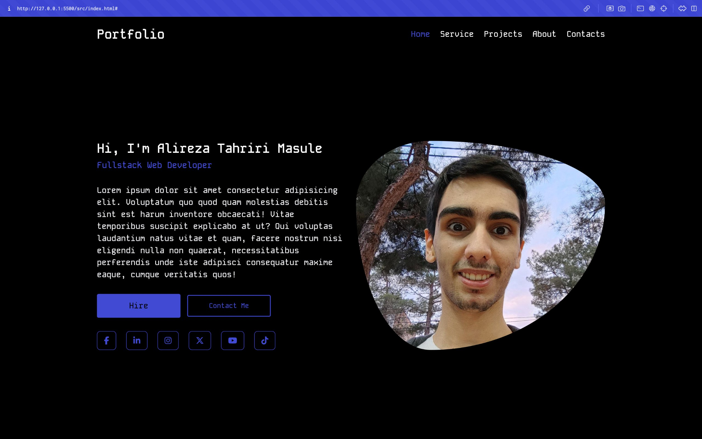

# Portfolio Template

This is a simple portfolio template where users can add their personal details and contact information. It's designed to help you showcase your work, skills, and ways to get in touch.

## Features

- Responsive design for all devices
- Easy to customize
- Includes sections for:
  - About Me
  - Work Experience (coming soon)
  - Skills (coming soon)
  - Projects (coming soon)
  - Contact Information

## Usage

1. Clone the repository:
    
    ```bash
    git clone https://github.com/alireza-tahriri-masule/portfolio.git
    ```

2. Customize the information:

   Open the `index.html` file and replace the placeholder content with your own details. You can update your name, bio, skills, experience, and projects.

3. Use it :)

   After customizing, you can upload the project to your own server or use a free hosting service like GitHub Pages to make your portfolio accessible online.
